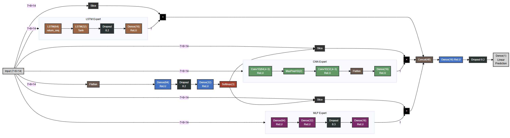

# Proyecto de Predicción de Captura Pesquera con Mixture of Experts (MoE)

## Descripción
Este proyecto implementa un modelo de Mixture of Experts (MoE) para predecir capturas pesqueras considerando variables climáticas y datos históricos. El modelo combina tres expertos especializados: LSTM, CNN y MLP, coordinados por una red de control (gating network).

## Estructura del Modelo


### Componentes Principales:
- **Gating Network**: Red neuronal que asigna pesos a cada experto
- **Expertos**:
  - LSTM: Para patrones temporales
  - CNN: Para patrones espaciales
  - MLP: Para relaciones no lineales generales

## Requisitos
- Python 3.11+
- TensorFlow 2.x
- pandas
- numpy
- scikit-learn
- matplotlib
- seaborn

## Estructura del Proyecto
```
CC-DLM-MFisheries/
├── data/                  # Datos de entrada
├── modelos_moe/          # Modelos entrenados
├── resultados_moe/       # Resultados y predicciones
├── scripts/              # Scripts auxiliares
└── notebooks/           
    ├── Prepare_data.ipynb        # Preparación de datos
    ├── Forecast_one_species.ipynb # Predicción por especie
    └── analisis_económico.ipynb  # Análisis económico
```

## Uso
1. Preparación de datos:
```python
python scripts/prepare_data.py
```

2. Entrenamiento del modelo:
```python
python scripts/train_model.py --species SPECIES_NAME --cluster CLUSTER_NUMBER
```

3. Predicción:
```python
python scripts/predict.py --model_path "modelos_moe/MODEL_NAME.h5"
```

## Variables de Entrada
- Temperatura superficial del mar
- Datos históricos de captura
- Variables oceanográficas
- Información espacial

## Resultados
Los resultados incluyen:
- Predicciones mensuales por especie
- Intervalos de confianza
- Análisis económico por grupo funcional
- Visualizaciones de tendencias

## Referencias
- [Documentación del modelo](model.md)
- [Análisis económico](analisis_económico.ipynb)

## Licencia
MIT


