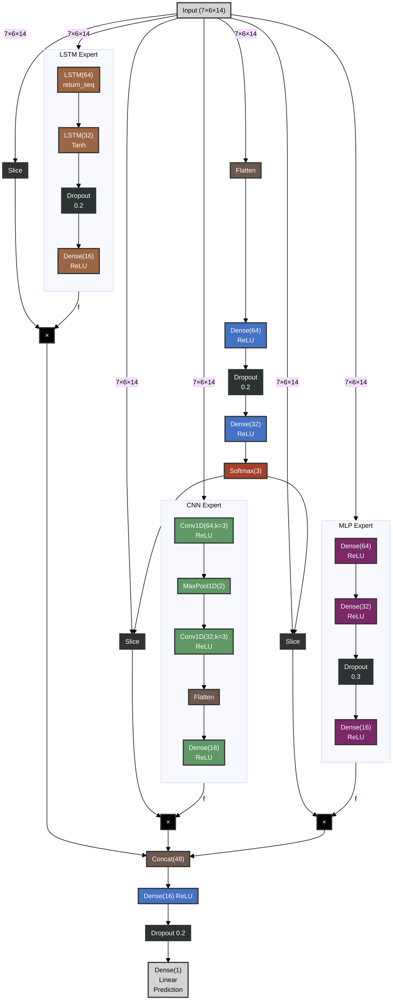

```mermaid
%%{init: {
  'theme': 'base',
  'themeVariables': {
    'fontSize': '12px',
    'fontFamily': 'arial',
    'primaryTextColor': '#000',
    'primaryBorderColor': '#333',
    'nodeBorder': '2px'
  },
  'securityLevel': 'loose',
  'flowchart': {
    'htmlLabels': true,
    'curve': 'basis',
    'padding': 5,
    'nodeSpacing': 30,
    'rankSpacing': 40,
    'diagramPadding': 5
  }
}}%%

flowchart TD
    %% Input
    input_228["Input (7×6×14)"] --> |7×6×14| exp1
    input_228 --> |7×6×14| sliceA["Slice"]
    input_228 --> |7×6×14| exp2
    input_228 --> |7×6×14| sliceB["Slice"]
    input_228 --> |7×6×14| sliceC["Slice"]
    input_228 --> |7×6×14| exp3
    
    %% Gating Network
    input_228 --> |7×6×14| flatten["Flatten"]
    flatten --> dense1["Dense(64)<br>ReLU"] --> drop1["Dropout<br>0.2"]
    drop1 --> dense2["Dense(32)<br>ReLU"] --> act2["Softmax(3)"]
    
    %% Expert 1 - LSTM
    subgraph exp1 [LSTM Expert]
        direction TB
        lstm1["LSTM(64)<br>return_seq"] --> lstm2["LSTM(32)<br>Tanh"] 
        lstm2 --> lstm_drop["Dropout<br>0.2"]
        lstm_drop --> lstm_out["Dense(16)<br>ReLU"]
    end
    
    %% Expert 2 - CNN
    subgraph exp2 [CNN Expert]
        direction TB
        conv1["Conv1D(64,k=3)<br>ReLU"] --> max_pool["MaxPool1D(2)"]
        max_pool --> conv2["Conv1D(32,k=3)<br>ReLU"]
        conv2 --> flat["Flatten"]
        flat --> cnn_out["Dense(16)<br>ReLU"]
    end
    
    %% Expert 3 - MLP
    subgraph exp3 [MLP Expert]
        direction TB
        mlp_in["Dense(64)<br>ReLU"] --> mlp_mid["Dense(32)<br>ReLU"]
        mlp_mid --> mlp_drop["Dropout<br>0.3"]
        mlp_drop --> mlp_out["Dense(16)<br>ReLU"]
    end
    
    %% Activation connections
    act2 --> sliceB
    act2 --> sliceC
    
    %% Multiplications
    exp1 --> |f| mult1["×"]
    sliceA --> mult1
    
    exp2 --> |f| mult2["×"]
    sliceB --> mult2
    
    exp3 --> |f| mult3["×"]
    sliceC --> mult3
    
    %% Combination
    mult1 & mult2 & mult3 --> concat["Concat(48)"]
    concat --> dense_final["Dense(16) ReLU"] --> final_drop["Dropout 0.2"]
    final_drop --> output["Dense(1)<br>Linear<br>Prediction"]

    %% Styles
    classDef inputNode fill:#d3d3d3,stroke:#333,stroke-width:2px
    classDef gateNode fill:#4472C4,color:white,stroke:#333,stroke-width:2px
    classDef activationNode fill:#A53F2B,color:white,stroke:#333,stroke-width:2px
    classDef lstmNode fill:#9c6644,color:white,stroke:#333,stroke-width:2px
    classDef cnnNode fill:#609966,color:white,stroke:#333,stroke-width:2px
    classDef mlpNode fill:#7b2869,color:white,stroke:#333,stroke-width:2px
    classDef dropoutNode fill:#2c3333,color:white,stroke:#333,stroke-width:2px
    classDef flattenNode fill:#6C584C,color:white,stroke:#333,stroke-width:2px
    classDef sliceNode fill:#333333,color:white,stroke:#333,stroke-width:2px
    classDef multNode fill:#000000,color:white,stroke:#333,stroke-width:2px
    classDef concatNode fill:#6C584C,color:white,stroke:#333,stroke-width:2px
    classDef outputNode fill:#d3d3d3,stroke:#333,stroke-width:2px

    %% Layout settings to make diagram more compact
    %%{
      init: {
        'flowchart': {
          'useMaxWidth': false,
          'width': 400,
          'height': 600
        }
      }
    }%%

    class input_228 inputNode
    class dense1,dense2,dense_final gateNode
    class act2 activationNode
    class flatten,flat,concat flattenNode
    class lstm1,lstm2,lstm_out lstmNode
    class conv1,conv2,max_pool,cnn_out cnnNode
    class mlp_in,mlp_mid,mlp_out mlpNode
    class drop1,lstm_drop,mlp_drop,final_drop dropoutNode
    class sliceA,sliceB,sliceC sliceNode
    class mult1,mult2,mult3 multNode
    class output outputNode
```
````
